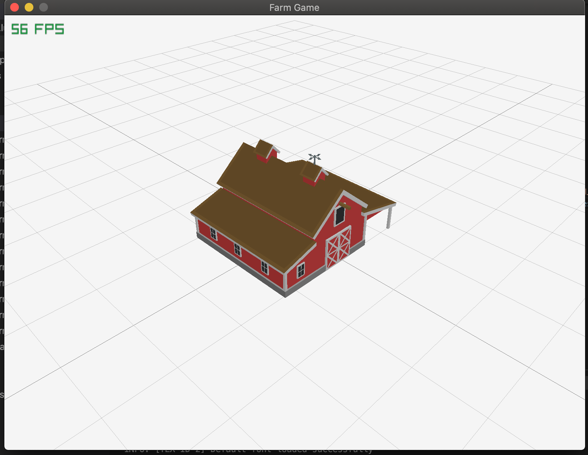

# LuaJIT-Raylib
Here you can find the bindings for luajit and raylib, raygui is also included.

# Notes
You must compile raylib and raygui into .dlls and then reference them at the top of both raylib.lua and raygui.lua.

# Version
LUAJIT version 2.0.5

Raylib version 2.6.0

Raygui version 2.6
